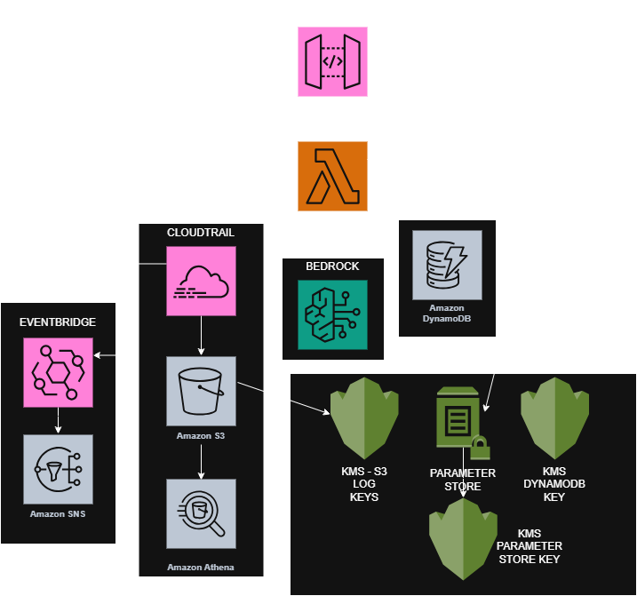
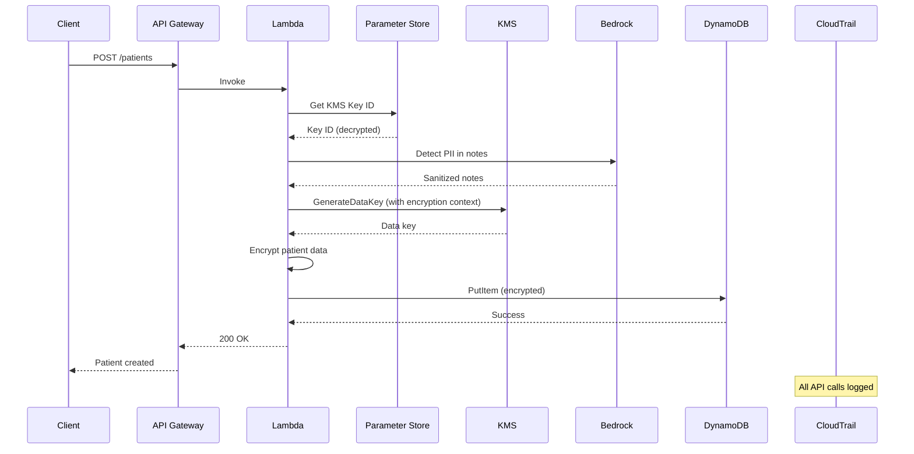

# Healthcare Security Platform

HIPAA-compliant patient records management system with multi-layer encryption, AI-powered PII detection, and comprehensive audit logging.

[](https://terraform.io)
[](https://aws.amazon.com)
[](docs/compliance.md)
[](LICENSE)

## Table of Contents

- [Overview](#overview)
- [Architecture](#architecture)
- [Project Structure](#project-structure)
- [Prerequisites](#prerequisites)
- [Deployment Guide](#deployment-guide)
  - [Stage 00: Foundation](#stage-00-foundation)
  - [Stage 01: KMS Keys](#stage-01-kms-keys)
  - [Stage 02: DynamoDB](#stage-02-dynamodb)
  - [Stage 03: Parameter Store](#stage-03-parameter-store)
  - [Stage 04: Lambda Functions](#stage-04-lambda-functions)
  - [Stage 05: API Gateway](#stage-05-api-gateway)
  - [Stage 06: Bedrock Integration](#stage-06-bedrock-integration)
  - [Stage 07: CloudTrail and S3 Logging](#stage-07-cloudtrail-and-s3-logging)
  - [Stage 08: Athena](#stage-08-athena)
  - [Stage 09: Monitoring and Alerts](#stage-09-monitoring-and-alerts)
- [Security Features](#security-features)
- [Cost Estimate](#cost-estimate)
- [Cleanup](#cleanup)

## Overview

This project demonstrates enterprise-grade AWS security architecture for healthcare data. It implements defense-in-depth principles with multiple layers of encryption, real-time PII detection using Amazon Bedrock, and comprehensive audit logging for compliance.

### Key Features

- **Multi-layer encryption**: Client-side encryption with KMS customer-managed keys and encryption context for per-patient data isolation
- **AI-powered security**: Amazon Bedrock with Claude for PII detection and Guardrails for policy enforcement
- **Comprehensive audit trail**: CloudTrail logging to S3 with Athena queries for compliance reporting
- **Real-time threat detection**: EventBridge rules triggering SNS alerts for security events
- **Infrastructure as Code**: 100% Terraform with modular, reusable components

## Architecture



### Architecture Components

| Layer | Component | Purpose |
|-------|-----------|---------|
| **API Layer** | API Gateway | REST API entry point with request validation |
| **Compute Layer** | Lambda Functions | CRUD operations with client-side encryption |
| **Data Layer** | DynamoDB | Patient records storage with server-side encryption |
| **AI Layer** | Amazon Bedrock | PII detection and content filtering |
| **Security Layer** | KMS (3 keys) | Customer-managed keys for DynamoDB, S3, Parameter Store |
| **Security Layer** | Parameter Store | Encrypted secrets storage |
| **Audit Layer** | CloudTrail | API call logging |
| **Audit Layer** | S3 | Encrypted log storage |
| **Audit Layer** | Athena | SQL queries for compliance reporting |
| **Monitoring Layer** | EventBridge | Security event detection |
| **Monitoring Layer** | SNS | Alert notifications |

### Data Flow: Create Patient Record


## Project Structure
```
healthcare-security-platform/
├── terraform/
│   ├── environments/
│   │   └── dev/
│   │       ├── providers.tf      # AWS provider and S3 backend
│   │       ├── main.tf           # Module calls
│   │       └── outputs.tf        # Environment outputs
│   └── modules/
│       ├── kms/                  # KMS keys for encryption
│       ├── dynamodb/             # Patient records table
│       ├── parameter-store/      # Secrets management
│       ├── lambda/               # Lambda functions
│       ├── api-gateway/          # REST API
│       ├── bedrock/              # AI integration
│       ├── cloudtrail/           # Audit logging
│       ├── s3-logging/           # Log storage
│       ├── athena/               # Compliance queries
│       └── monitoring/           # Alerts and dashboards
├── lambda-functions/             # Lambda source code
├── images/                       # Architecture diagrams
├── docs/                         # Additional documentation
└── scripts/                      # Deployment and utility scripts
```

## Prerequisites

### Required Tools

| Tool | Version | Installation |
|------|---------|--------------|
| Terraform | >= 1.5.0 | [Install Guide](https://terraform.io/downloads) |
| AWS CLI | >= 2.0.0 | [Install Guide](https://docs.aws.amazon.com/cli/latest/userguide/getting-started-install.html) |
| Git | >= 2.30.0 | [Install Guide](https://git-scm.com/downloads) |

### AWS Account Setup

This project uses AWS Organizations with a dedicated member account:

| Account | Purpose |
|---------|---------|
| Management Account | AWS Organizations, billing, governance |
| Healthcare-Security-Dev | All project resources |

## Deployment Guide

### Initial Setup

1. Clone the repository:
```bash
git clone https://github.com/jbray1992/healthcare-security-platform.git
cd healthcare-security-platform
```

2. Create the Terraform backend (one-time manual setup):
```bash
# Create S3 bucket for state
aws s3api create-bucket \
  --bucket healthcare-tfstate-<ACCOUNT_ID> \
  --region us-east-1

# Enable versioning
aws s3api put-bucket-versioning \
  --bucket healthcare-tfstate-<ACCOUNT_ID> \
  --versioning-configuration Status=Enabled

# Block public access
aws s3api put-public-access-block \
  --bucket healthcare-tfstate-<ACCOUNT_ID> \
  --public-access-block-configuration \
  "BlockPublicAcls=true,IgnorePublicAcls=true,BlockPublicPolicy=true,RestrictPublicBuckets=true"

# Create DynamoDB table for state locking
aws dynamodb create-table \
  --table-name healthcare-terraform-lock \
  --attribute-definitions AttributeName=LockID,AttributeType=S \
  --key-schema AttributeName=LockID,KeyType=HASH \
  --billing-mode PAY_PER_REQUEST \
  --region us-east-1
```

3. Update the backend configuration in `terraform/environments/dev/providers.tf` with your bucket name.

---

### Stage 00: Foundation

**Status**: ✅ Complete

**What it creates**:
- S3 bucket for Terraform state (manual)
- DynamoDB table for state locking (manual)

**Files**: None (manual setup)

---

### Stage 01: KMS Keys

**Status**: ✅ Complete

**What it creates**:
- KMS key for DynamoDB patient records encryption
- KMS key for S3 CloudTrail logs encryption
- KMS key for Parameter Store secrets encryption
- KMS aliases for each key

**Files**: [terraform/modules/kms/](terraform/modules/kms/)

**Deploy**:
```bash
cd terraform/environments/dev
terraform init
terraform plan
terraform apply
```

**Outputs**:

| Output | Description |
|--------|-------------|
| `dynamodb_key_arn` | ARN of the DynamoDB encryption key |
| `s3_logs_key_arn` | ARN of the S3 logs encryption key |
| `parameter_store_key_arn` | ARN of the Parameter Store encryption key |

---

### Stage 02: DynamoDB

**Status**: ✅ Complete


**What it creates**:
- DynamoDB table for patient records
- Server-side encryption with KMS
- Point-in-time recovery enabled

**Files**: [terraform/modules/dynamodb/](terraform/modules/dynamodb/)

---

### Stage 03: Parameter Store

**Status**: ✅ Complete

**What it creates**:
- SecureString parameters for secrets
- KMS encryption for all parameters

**Files**: [terraform/modules/parameter-store/](terraform/modules/parameter-store/)

---

### Stage 04: Lambda Functions

**Status**: ✅ Complete

**What it creates**:
- Lambda functions for CRUD operations
- Client-side encryption implementation
- Bedrock integration for PII detection

**Files**: [terraform/modules/lambda/](terraform/modules/lambda/) | [lambda-functions/](lambda-functions/)

---

### Stage 05: API Gateway

**Status**: ✅ Complete

**What it creates**:
- REST API with resource policies
- Request validation
- Lambda integrations

**Files**: [terraform/modules/api-gateway/](terraform/modules/api-gateway/)

---

### Stage 06: Bedrock Integration

**Status**: ✅ Complete

**What it creates**:
- Bedrock Guardrails for PII filtering
- IAM permissions for Bedrock access

**Files**: [terraform/modules/bedrock/](terraform/modules/bedrock/)

---

### Stage 07: CloudTrail and S3 Logging

**Status**: 🔲 Not Started

**What it creates**:
- S3 bucket for audit logs
- CloudTrail trail with KMS encryption
- S3 lifecycle policies

**Files**: [terraform/modules/cloudtrail/](terraform/modules/cloudtrail/) | [terraform/modules/s3-logging/](terraform/modules/s3-logging/)

---

### Stage 08: Athena

**Status**: 🔲 Not Started

**What it creates**:
- Athena database and workgroup
- Saved queries for compliance reporting

**Files**: [terraform/modules/athena/](terraform/modules/athena/)

---

### Stage 09: Monitoring and Alerts

**Status**: 🔲 Not Started

**What it creates**:
- SNS topic for security alerts
- EventBridge rules for threat detection
- CloudWatch alarms

**Files**: [terraform/modules/monitoring/](terraform/modules/monitoring/)

---

## Security Features

### Encryption

| Layer | Method | Key Type |
|-------|--------|----------|
| Data at rest (DynamoDB) | Server-side + Client-side | Customer managed KMS |
| Data at rest (S3) | Server-side | Customer managed KMS |
| Data at rest (Parameter Store) | Server-side | Customer managed KMS |
| Data in transit | TLS 1.2+ | AWS managed |

### Encryption Context

Client-side encryption uses encryption context to bind ciphertext to specific patients:
```json
{
    "patient_id": "P12345",
    "record_type": "medical"
}
```

Decryption fails if the context does not match, providing cryptographic isolation between patients.

### PII Detection

Amazon Bedrock scans clinical notes for:

| PII Type | Action |
|----------|--------|
| Social Security Numbers | Blocked |
| Credit card numbers | Blocked |
| Phone numbers | Anonymized |
| Email addresses | Anonymized |
| Physical addresses | Anonymized |

### Audit Logging

CloudTrail captures all API calls including:
- KMS key usage (encrypt, decrypt, generate data key)
- DynamoDB operations (GetItem, PutItem, Query)
- Bedrock invocations
- Parameter Store access

## Cost Estimate

| Resource | Monthly Cost |
|----------|-------------|
| KMS (3 keys) | $3.00 |
| DynamoDB (on-demand) | ~$0.25 |
| Lambda | Free tier |
| API Gateway | ~$0.50 |
| S3 (logs) | ~$0.15 |
| CloudTrail | ~$2.00 |
| Bedrock | ~$0.50 |
| Athena | ~$0.05 |
| SNS | Free tier |
| EventBridge | Free tier |
| **Total** | **~$6-8/month** |

## Cleanup

To destroy all resources:
```bash
cd terraform/environments/dev
terraform destroy
```

The S3 bucket for Terraform state and DynamoDB lock table must be deleted manually:
```bash
# Empty and delete state bucket
aws s3 rm s3://healthcare-tfstate-<ACCOUNT_ID> --recursive
aws s3 rb s3://healthcare-tfstate-<ACCOUNT_ID>

# Delete lock table
aws dynamodb delete-table --table-name healthcare-terraform-lock
```

## Author

**Jordan Bray** - Cloud Security Engineer

[](https://github.com/jbray1992)
[](https://www.linkedin.com/in/jordan-bray-a2a83a113/)

## License

This project is licensed under the MIT License - see the [LICENSE](LICENSE) file for details.
