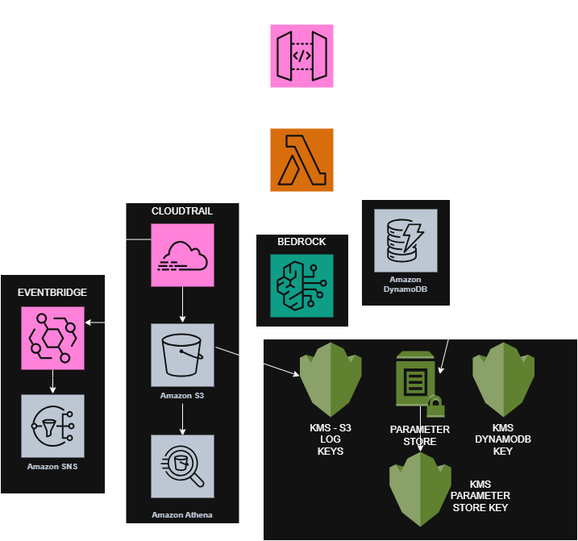
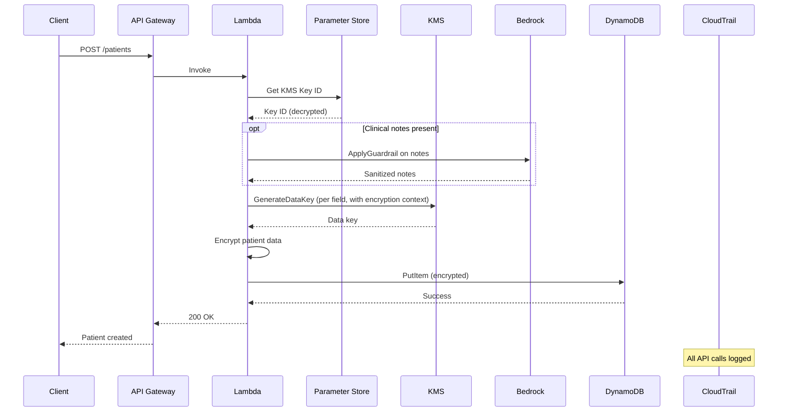

# Healthcare Security Platform

Patient records management system implementing HIPAA-aligned technical safeguards: multi-layer encryption, AI-powered PII detection, and comprehensive audit logging. (Technical implementation only — actual HIPAA compliance also requires a signed BAA, administrative and physical safeguards, and a third-party audit.)

[](https://terraform.io)
[](https://aws.amazon.com)
[](#security-features)
[](LICENSE)

## Table of Contents

- [Overview](#overview)
- [Architecture](#architecture)
- [Project Structure](#project-structure)
- [Prerequisites](#prerequisites)
- [Deployment Guide](#deployment-guide)
  - [Stage 00: Foundation](#stage-00-foundation)
  - [Stage 01: KMS Keys](#stage-01-kms-keys)
  - [Stage 02: DynamoDB](#stage-02-dynamodb)
  - [Stage 03: Parameter Store](#stage-03-parameter-store)
  - [Stage 04: Lambda Functions](#stage-04-lambda-functions)
  - [Stage 05: API Gateway](#stage-05-api-gateway)
  - [Stage 06: Bedrock Integration](#stage-06-bedrock-integration)
  - [Stage 07: CloudTrail and S3 Logging](#stage-07-cloudtrail-and-s3-logging)
  - [Stage 08: Athena](#stage-08-athena)
  - [Stage 09: Monitoring and Alerts](#stage-09-monitoring-and-alerts)
- [Security Features](#security-features)
- [Cost Estimate](#cost-estimate)
- [Cleanup](#cleanup)

## Overview

This project demonstrates enterprise-grade AWS security architecture for healthcare data. It implements defense-in-depth principles with multiple layers of encryption, real-time PII detection using Amazon Bedrock, and comprehensive audit logging for compliance.

### Key Features

- **Multi-layer encryption**: Client-side encryption with KMS customer-managed keys and encryption context for per-patient data isolation
- **AI-powered security**: Amazon Bedrock Guardrails for probabilistic PII detection and policy enforcement on patient clinical notes
- **Comprehensive audit trail**: CloudTrail logging to S3 with Athena queries for compliance reporting
- **Near-real-time security event notification**: EventBridge rules triggering SNS email alerts on KMS key deletion, IAM policy changes, AccessDenied errors, and root account sign-in
- **Infrastructure as Code**: 100% Terraform with modular, reusable components

## Architecture



### Architecture Components

| Layer | Component | Purpose |
|-------|-----------|---------|
| **API Layer** | API Gateway | REST API with API key authentication, JSON schema request validation, and per-key usage throttling |
| **Compute Layer** | Lambda Functions | CRUD operations with envelope encryption (KMS data keys + AES-256-GCM) |
| **Data Layer** | DynamoDB | Patient records storage with server-side encryption |
| **AI Layer** | Amazon Bedrock | PII detection and content filtering |
| **Security Layer** | KMS (3 keys) | Customer-managed keys for DynamoDB, S3, Parameter Store |
| **Security Layer** | Parameter Store | Encrypted secrets storage |
| **Audit Layer** | CloudTrail | API call logging |
| **Audit Layer** | S3 | Encrypted log storage |
| **Audit Layer** | Athena | SQL queries for compliance reporting |
| **Monitoring Layer** | EventBridge | Security event detection |
| **Monitoring Layer** | SNS | Alert notifications |

### Data Flow: Create Patient Record

```mermaid
sequenceDiagram
    participant Client
    participant API Gateway
    participant Lambda
    participant Parameter Store
    participant KMS
    participant Bedrock
    participant DynamoDB
    participant CloudTrail

    Client->>API Gateway: POST /patients
    API Gateway->>Lambda: Invoke
    Lambda->>Parameter Store: Get KMS Key ID
    Parameter Store-->>Lambda: Key ID (decrypted)
    opt Clinical notes present
        Lambda->>Bedrock: ApplyGuardrail on notes
        Bedrock-->>Lambda: Sanitized notes
    end
    Lambda->>KMS: GenerateDataKey (per field, with encryption context)
    KMS-->>Lambda: Data key
    Lambda->>Lambda: Encrypt patient data
    Lambda->>DynamoDB: PutItem (encrypted)
    DynamoDB-->>Lambda: Success
    Lambda-->>API Gateway: 200 OK
    API Gateway-->>Client: Patient created
    Note over CloudTrail: All API calls logged
```

## Project Structure
```
healthcare-security-platform/
├── terraform/
│   ├── environments/
│   │   └── dev/
│   │       ├── providers.tf            # AWS provider and S3 backend
│   │       ├── main.tf                 # Module calls
│   │       ├── variables.tf            # Input variables (e.g., alert_email)
│   │       ├── outputs.tf              # Environment outputs
│   │       └── terraform.tfvars.example # Template for required variables
│   └── modules/
│       ├── kms/                  # KMS keys with rotation enabled
│       ├── dynamodb/             # Patient records table with PITR + SSE-KMS
│       ├── parameter-store/      # SecureString parameter for KMS key ID
│       ├── lambda/               # Envelope-encryption Lambda + build pipeline
│       ├── api-gateway/          # REST API with API key auth, validation, throttling
│       ├── bedrock/              # PII detection guardrail (7 entity types)
│       ├── cloudtrail/           # Audit trail with KMS encryption + log validation
│       ├── athena/               # Workgroup, Glue table, named compliance queries
│       └── monitoring/           # EventBridge rules, SNS topic, CloudWatch alarms
├── lambda-functions/
│   └── patient-records/
│       ├── index.py              # Handler: encrypt/decrypt, guardrail, CRUD
│       └── requirements.txt      # Python dependencies (cryptography)
├── images/
│   └── architecture.png          # Architecture diagram
├── README.md
├── LICENSE
└── .gitignore
```

## Prerequisites

### Required Tools

| Tool | Version | Installation |
|------|---------|--------------|
| Terraform | >= 1.5.0 | [Install Guide](https://terraform.io/downloads) |
| AWS CLI | >= 2.0.0 | [Install Guide](https://docs.aws.amazon.com/cli/latest/userguide/getting-started-install.html) |
| Git | >= 2.30.0 | [Install Guide](https://git-scm.com/downloads) |

### AWS Account Setup

This project deploys into a single AWS account. The recommended pattern is an AWS Organizations member account dedicated to the workload, with the management account reserved for billing and governance:

| Account | Purpose |
|---------|---------|
| Management Account | AWS Organizations, billing, IAM Identity Center, governance |
| Workload Account (e.g., `Healthcare-Security-Dev`) | All resources for this project — KMS, DynamoDB, Lambda, API Gateway, etc. |

The example commands assume credentials for the workload account. If using cross-account role assumption from the management account, set `AWS_ACCESS_KEY_ID`, `AWS_SECRET_ACCESS_KEY`, and `AWS_SESSION_TOKEN` from `aws sts assume-role` output.

## Deployment Guide

### Initial Setup

1. Clone the repository:
```bash
git clone https://github.com/jbray1992/healthcare-security-platform.git
cd healthcare-security-platform
```

2. Create the Terraform backend (one-time manual setup):
```bash
# Create S3 bucket for state
aws s3api create-bucket \
  --bucket healthcare-tfstate-<ACCOUNT_ID> \
  --region us-east-1

# Enable versioning
aws s3api put-bucket-versioning \
  --bucket healthcare-tfstate-<ACCOUNT_ID> \
  --versioning-configuration Status=Enabled

# Block public access
aws s3api put-public-access-block \
  --bucket healthcare-tfstate-<ACCOUNT_ID> \
  --public-access-block-configuration \
  "BlockPublicAcls=true,IgnorePublicAcls=true,BlockPublicPolicy=true,RestrictPublicBuckets=true"

# Create DynamoDB table for state locking
aws dynamodb create-table \
  --table-name healthcare-terraform-lock \
  --attribute-definitions AttributeName=LockID,AttributeType=S \
  --key-schema AttributeName=LockID,KeyType=HASH \
  --billing-mode PAY_PER_REQUEST \
  --region us-east-1
```

3. Update the backend configuration in `terraform/environments/dev/providers.tf` with your bucket name.

4. Provide required variables. Copy the example tfvars file and fill it in:
```bash
cp terraform/environments/dev/terraform.tfvars.example terraform/environments/dev/terraform.tfvars
# Edit terraform.tfvars and set alert_email to your address
```

5. Deploy the entire stack with a single apply:
```bash
cd terraform/environments/dev
terraform init
terraform plan
terraform apply
```

The stages below describe what each module produces. They are deployed together by the single root module, not iteratively. The descriptions are organized by concern (KMS, then DynamoDB, etc.) for readability.

---

### Stage 00: Foundation

**Status**: ✅ Complete

**What it creates**:
- S3 bucket for Terraform state (manual)
- DynamoDB table for state locking (manual)

**Files**: None (manual setup)

---

### Stage 01: KMS Keys

**Status**: ✅ Complete

**What it creates**:
- KMS key for DynamoDB patient records encryption
- KMS key for S3 CloudTrail logs encryption
- KMS key for Parameter Store secrets encryption
- KMS aliases for each key

**Files**: [terraform/modules/kms/](terraform/modules/kms/)

---

### Stage 02: DynamoDB

**Status**: ✅ Complete


**What it creates**:
- DynamoDB table for patient records
- Server-side encryption with KMS
- Point-in-time recovery enabled

**Files**: [terraform/modules/dynamodb/](terraform/modules/dynamodb/)

---

### Stage 03: Parameter Store

**Status**: ✅ Complete

**What it creates**:
- SecureString parameter for the DynamoDB KMS key ID
- KMS-encrypted at rest using a dedicated customer-managed key

**Files**: [terraform/modules/parameter-store/](terraform/modules/parameter-store/)

---

### Stage 04: Lambda Functions

**Status**: ✅ Complete

**What it creates**:
- Lambda functions for CRUD operations on patient records
- Envelope encryption (KMS `GenerateDataKey` + local AES-256-GCM) for per-field client-side encryption
- Encryption context binding ciphertext to `patient_id` and `record_type` for cryptographic patient isolation
- Bedrock guardrail integration for PII detection in clinical notes
- Python `cryptography` library packaged with the deployment artifact

**Files**: [terraform/modules/lambda/](terraform/modules/lambda/) | [lambda-functions/](lambda-functions/)

---

### Stage 05: API Gateway

**Status**: ✅ Complete

**What it creates**:
- REST API with three routes: POST /patients, GET /patients/{patient_id}, DELETE /patients/{patient_id}
- API key authentication required on all methods (`api_key_required = true`)
- Request body validation against a JSON schema (rejects malformed payloads at the gateway, before Lambda)
- Path parameter validation on GET and DELETE routes
- Throttling via usage plan: 10 req/s rate, 20 req/s burst, 10,000 req/month quota
- Lambda integrations (AWS_PROXY)

**Files**: [terraform/modules/api-gateway/](terraform/modules/api-gateway/)

---

### Stage 06: Bedrock Integration

**Status**: ✅ Complete

**What it creates**:
- Bedrock Guardrail with 7 PII entity types (BLOCK on SSN/credit card, ANONYMIZE on email/phone/name/address/ITIN)
- Guardrail version pinned for stable Lambda invocation

> Bedrock invocation permissions (`bedrock:InvokeModel`, `bedrock:ApplyGuardrail`) are granted in the Lambda IAM role (see Stage 04), not in this module.

**Files**: [terraform/modules/bedrock/](terraform/modules/bedrock/)

---

### Stage 07: CloudTrail and S3 Logging

**Status**: ✅ Complete

**What it creates**:
- S3 bucket for audit logs
- CloudTrail trail with KMS encryption
- S3 lifecycle policies

**Files**: [terraform/modules/cloudtrail/](terraform/modules/cloudtrail/)

---

### Stage 08: Athena

**Status**: ✅ Complete

**What it creates**:
- Glue catalog database and external table over CloudTrail logs (with partition projection on date and region — no Glue crawler needed)
- Athena workgroup with separate S3 bucket for query results (7-day lifecycle)
- Three saved queries for compliance reporting:
  - **`failed-access-attempts-7d`** — All AccessDenied / UnauthorizedAccess events in the last 7 days, with principal and source IP
  - **`kms-decrypt-by-patient`** — KMS Decrypt operations grouped by patient_id (extracted from encryption context), useful for spotting abnormal access patterns to a specific patient's records
  - **`root-account-usage`** — All actions performed by the root account in the last 30 days (should always return zero rows in a compliant environment)

**Files**: [terraform/modules/athena/](terraform/modules/athena/)

---

### Stage 09: Monitoring and Alerts

**Status**: ✅ Complete

**What it creates**:
- SNS topic for security alerts (requires `alert_email` variable to receive notifications)
- EventBridge rules for: KMS key deletion, IAM policy changes, unauthorized API calls (AccessDenied), root account console sign-in
- CloudWatch alarms for: Lambda errors, API Gateway 4xx error rate, API Gateway 5xx errors

> **Note:** Provide your email in `terraform.tfvars` as `alert_email = "you@example.com"`. After `terraform apply`, AWS will send an SNS subscription confirmation email — click the link to start receiving alerts.

**Files**: [terraform/modules/monitoring/](terraform/modules/monitoring/)

---

## Usage

After `terraform apply`, the API requires an API key on every request. Retrieve outputs and the key value:

```bash
cd terraform/environments/dev

# Get the API endpoint and key ID
API_ENDPOINT=$(terraform output -raw api_endpoint)
API_KEY_ID=$(terraform output -raw api_key_id)

# Fetch the actual key value (sensitive — do not log or commit)
API_KEY=$(aws apigateway get-api-key --api-key "$API_KEY_ID" --include-value --query value --output text)
```

### Create a patient record

```bash
curl -X POST "$API_ENDPOINT/patients" \
  -H "Content-Type: application/json" \
  -H "x-api-key: $API_KEY" \
  -d '{
    "patient_id": "P12345",
    "record_type": "DEMOGRAPHICS",
    "sensitive_data": {
      "ssn": "999-99-9999",
      "diagnosis": "Hypertension"
    }
  }'
```

### Retrieve a patient record

```bash
curl "$API_ENDPOINT/patients/P12345?record_type=DEMOGRAPHICS" \
  -H "x-api-key: $API_KEY"
```

### Delete a patient record

```bash
curl -X DELETE "$API_ENDPOINT/patients/P12345?record_type=DEMOGRAPHICS" \
  -H "x-api-key: $API_KEY"
```

Requests without a valid `x-api-key` header receive HTTP 403. Malformed request bodies (missing `patient_id`, invalid characters, wrong types) are rejected at the API Gateway layer with HTTP 400 before reaching the Lambda function.

## Security Features

### Encryption

| Layer | Method | Key Type |
|-------|--------|----------|
| Data at rest (DynamoDB, server-side) | AWS-managed encryption with customer KMS key | Customer managed KMS |
| Data at rest (DynamoDB, application layer) | Envelope encryption: KMS-issued AES-256 data keys, local AES-256-GCM per field | Customer managed KMS |
| Data at rest (S3) | Server-side | Customer managed KMS |
| Data at rest (Parameter Store) | Server-side | Customer managed KMS |
| Data in transit | TLS 1.2+ | AWS managed |

### Encryption Context

Client-side encryption uses encryption context to bind ciphertext to specific patients:
```json
{
    "patient_id": "P12345",
    "record_type": "medical"
}
```

Decryption fails if the context does not match, providing cryptographic isolation between patients.

### PII Detection

Amazon Bedrock scans clinical notes for:

| PII Type | Action |
|----------|--------|
| Social Security Numbers | Blocked |
| Credit card numbers | Blocked |
| Names | Anonymized |
| Phone numbers | Anonymized |
| Email addresses | Anonymized |
| Physical addresses | Anonymized |
| US Individual Tax Identification Numbers | Anonymized |

### Audit Logging

CloudTrail captures management events for all AWS API calls in the deployment region, plus data events for:
- DynamoDB table operations (`AWS::DynamoDB::Table`)
- S3 object operations (`AWS::S3::Object`)

Captured management events include KMS encrypt/decrypt/`GenerateDataKey` calls, Parameter Store reads, IAM changes, and console sign-ins. Log file integrity validation is enabled, producing tamper-evident hash digests.

## Limitations and Design Tradeoffs

This project demonstrates technical safeguards in a portfolio context. Several intentional simplifications would not be appropriate for a real production deployment:

- **API key authentication is sufficient for demo but not production.** A real patient portal would use a Cognito user pool or IAM auth so each request is tied to a specific authenticated user identity. API keys are bearer credentials with no per-user attribution.
- **Single-region trail.** CloudTrail is configured for the deployment region only. Production HIPAA workloads typically use a multi-region or organization-wide trail with logs aggregated in a dedicated logging account.
- **No WAF in front of the API.** API Gateway throttling and validation are useful but do not replace a Web Application Firewall for protection against scraping, abuse patterns, or geo-restriction.
- **No multi-region DR.** DynamoDB and KMS keys are single-region. RTO/RPO objectives for actual healthcare data would typically require Global Tables and multi-region keys.
- **No real Business Associate Agreement.** This is a personal portfolio project. AWS HIPAA-eligible service usage is meaningful only when paired with a signed BAA between the covered entity / business associate and AWS.
- **No formal threat model or risk assessment.** Demonstrated controls are derived from common HIPAA technical safeguard interpretations, not from a documented risk assessment for a specific covered entity.

These are deliberate scope decisions for a portfolio piece. Each one is a candidate for a follow-up project.

## Cost Estimate

| Resource | Monthly Cost |
|----------|-------------|
| KMS (3 keys) | $3.00 |
| DynamoDB (on-demand) | ~$0.25 |
| Lambda | Free tier |
| API Gateway | ~$0.50 |
| S3 (logs) | ~$0.15 |
| CloudTrail | ~$2.00 |
| Bedrock | ~$0.50 |
| Athena | ~$0.05 |
| SNS | Free tier |
| EventBridge | Free tier |
| **Total** | **~$6-8/month** |

## Cleanup

To destroy all resources:
```bash
cd terraform/environments/dev
terraform destroy
```

The S3 bucket for Terraform state and DynamoDB lock table must be deleted manually:
```bash
# Empty and delete state bucket
aws s3 rm s3://healthcare-tfstate-<ACCOUNT_ID> --recursive
aws s3 rb s3://healthcare-tfstate-<ACCOUNT_ID>

# Delete lock table
aws dynamodb delete-table --table-name healthcare-terraform-lock
```

## Author

**Jordan Bray** - Cloud Security Engineer

[](https://github.com/jbray1992)
[](https://www.linkedin.com/in/jordan-bray-a2a83a113/)

## License

This project is licensed under the MIT License - see the [LICENSE](LICENSE) file for details.
